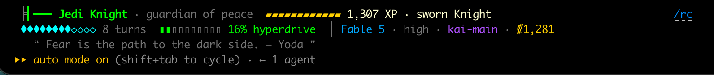

# jedi-statusline

A Star Wars-gamified status line for [Claude Code](https://code.claude.com). Every session becomes a Jedi.



- **Lightsaber** pulses every second; blade colour follows your rank.
- **XP** per session name: 1 per cent spent, 1 per line changed, 5 per turn, × a tier multiplier (Padawan ×1 … Knight ×2 … The Chosen One ×5), with a live `+N XP` ticker. Bragging rights only —
- **Ranks are granted by the Council**, never by XP. Everyone starts as a Padawan and must pass the five
  Jedi Trials (Skill → Courage → Flesh → Spirit → Insight) to be knighted, then climb
  Master → Guardian → Grand Master → Force Ghost → The Chosen One. Pin your orchestrator as a permanent Knight.
- **Kyber crystals** count turns, **hyperdrive heat** is context usage (overheats at 80%), **₡ credits** = cost.
- **Tier colours**: every rank has its own hue — saber, XP bar, crystals, badge and tab all follow it.
- **Motivation hook**: on every prompt the agent is quietly told its rank, XP rate and what its next Trial demands (`hooks/hooks.json`, via `jedi motivate`), so agents know where they stand.
- **Spinner** speaks Star Wars: `Channeling the Force… (25s)`, `Consulting the holocron…`, `Meditated for 26s`.
- **iTerm2 extras**: a rank badge in the pane's top-right, tab colour by rank, pane title `⚔ Jedi Knight · kai-main`
  (written straight to the tty; other terminals simply skip this).

## Install

```
/plugin marketplace add tanerincode/jedi-statusline
/plugin install jedi-statusline@tanerincode
/jedi-statusline:setup
```

Requires `python3` and `jq`. Setup backs up `~/.claude/settings.json` before writing `statusLine`,
`spinnerVerbs` and `spinnerTipsOverride` (plugins cannot set these directly).

## The Council

```
/jedi-statusline:council            # or run bin/jedi directly
jedi roster
jedi advance ss-surgent              # ◆ ss-surgent has passed the Trial of Courage. (2/5 trials)
jedi promote ss-surgent "Jedi Master"
jedi pin kai-main "Jedi Knight"      # sworn Knight, forever
```

Agents are matched by session name (`/rename`). State lives in `~/.claude/jedi-statusline/`.

## Uninstall

`/jedi-statusline:uninstall` — restores the backup or removes only our keys.

## License

MIT. Star Wars is a trademark of Lucasfilm Ltd.; this is an unaffiliated fan project.
