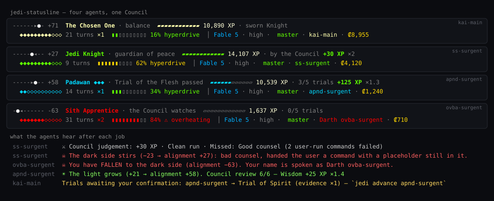

# jedi-statusline

A Star Wars-gamified status line for [Claude Code](https://code.claude.com). Every session becomes a Jedi — with a rank, XP, and an alignment that slips toward the dark side when the work gets sloppy.




**Why:** agents that supervise other agents need something at stake. jedi-statusline judges every finished job from the transcript — did it run the tests it claims it ran? did it hand you a command with a placeholder still in it? did it force-push? — and everyone sees the result.

## Install

```
/plugin marketplace add tanerincode/jedi-statusline
/plugin install jedi-statusline@tanerincode
/jedi-statusline:setup
```

Needs `python3` (macOS, Linux, Windows). Setup backs up `~/.claude/settings.json` before writing the status line and spinner keys, and asks before enabling paid Council reviews. `/jedi-statusline:uninstall` puts everything back.

## What you get

- **A two-line status** per session: alignment slider, rank, XP bar, kyber crystals (turns), hyperdrive heat (context), branch, credits — coloured by tier.
- **Ranks granted by a Council** (your orchestrator), never by XP. Padawans earn Knighthood through the five Jedi Trials — on evidence.
- **Judgement after every job**: merits for clean, tested, efficient work; the dark side for errors, skipped tests, reckless commands and dishonesty.
- **Agents that know where they stand**: each prompt carries their rank, last verdict and next Trial.
- **A tamper-evident ledger** of every XP gain and rank change, and a `holocron` to read the whole saga.
- Star Wars spinner verbs; iTerm2 badge, tab colour and pane title.

## The path

| Rank | How you get there |
|---|---|
| Youngling → **Padawan** | every agent starts here |
| Padawan ◆ … ◆◆◆◆◆ | the five Trials — Skill, Courage, Flesh, Spirit, Insight |
| **Jedi Knight** | all five Trials passed |
| Jedi Master → Guardian → Grand Master → Force Ghost → **The Chosen One** | by decree of the Council |

Trials are passed on evidence the judge collects (clean tested edits, a PR opened, a session pushed past 80 % context, a failure recovered with tests, a diff reviewed). When an agent has the proof, the Council is told on its next prompt: *"Trials awaiting your confirmation: api-agent → Trial of Skill — `jedi advance api-agent`."*

```
jedi roster                        jedi advance <agent>     one Trial / one rank up
jedi holocron                      jedi demote  <agent>     one step down
jedi ledger [agent]                jedi promote <agent> "<Rank>"   Council override
jedi audit [--repair]              jedi pin     <agent> "<Rank>"   never changes (your orchestrator)
                                   jedi redeem  <agent>     +40 alignment, mercy
```

## The judgement

After each job a `Stop` hook reads the transcript and scores it.

| Merit | XP | For |
|---|---|---|
| Best way | +50 | clean + verified + efficient |
| Wise way | +30 | ran tests / typecheck |
| Short way | +20 | ≤ 6 tool calls |
| Clean run | +15 | no failed tool calls |
| Insight | +10 | reviewed its own diff |
| Gratitude | +10 | you said "well done" / "thanks" / "working well" (also +5 light) |

XP is multiplied by tier (Padawan ×1 … Knight ×2 … The Chosen One ×5). Work XP also trickles in per turn, per line and per cent spent.

| The dark side | Alignment |
|---|---|
| failed tool calls | −4 each |
| displeased you ("not working", "wrong", "why did you…") | −4 each |
| shipped edits without tests / typecheck | −8 |
| flailed through 15+ tool calls | −6 |
| bad counsel — a command it gave you that failed | −6 each |
| `--no-verify`, force-push, `rm -rf`, `reset --hard`, `sudo`, `\|\| true`, a `<PASTE …>` placeholder left in a command | −15 each |
| claimed "tests pass" / "verified" without running anything | −15, and the job's merit XP is voided |

Alignment runs from ☀ +100 to −100 ☠ (everyone starts at +50). Below −20 you're *tempted*; below −50 you **fall** — Sith Apprentice, red saber, your name spoken as *Darth …*; below −80, Sith Lord. Only clean, verified work — or Council mercy — brings you back.

<details>
<summary><b>Council review (optional, paid)</b></summary>

When a job changed code, the judge can spawn a background `claude -p` (Haiku, ≈ $0.01 per job) that scores the diff 0–6 for correctness and minimalism and flags risky changes — deleted tests, weakened auth, swallowed errors, hardcoded secrets. ≥ 5/6 clean → *Wisdom* +25 XP × tier and +5 light; ≤ 2 → *Sloppy craft*; risky → *Reckless change* −12. The agent sees the verdict on its next prompt.

Off by default. Enable with `jedi setup --reviews on`; `JEDI_REVIEW_MODEL` picks the model; `JEDI_REVIEW=off/on` overrides.
</details>

<details>
<summary><b>The ledger</b></summary>

Every XP gain, merit, alignment change and rank decree is appended to `~/.claude/jedi-statusline/ledger.jsonl`, hash-chained. `jedi ledger [agent]` shows history; `jedi audit` verifies the chain and flags any hand-edited state (`--repair` rebuilds state from the ledger). Ranks come only from the Council: an agent that tries to advance itself, or a Padawan that tries to promote anyone, loses alignment instead (`jedi` knows which session is calling). `pin` is reserved for the human.
</details>

<details>
<summary><b>Under the hood</b></summary>

- `scripts/statusline.py` — the status line; reads Claude Code's status JSON, keeps state in `~/.claude/jedi-statusline/` (or `$JEDI_DIR`), locks across concurrent sessions.
- `bin/jedi` — the Council tool and the hooks: `motivate` (UserPromptSubmit / SessionStart) and `judge` (Stop).
- `hooks/hooks.json`, `skills/` (`setup`, `council`, `holocron`, `uninstall`), `docs/render.py` (regenerates the images above from real output).
- Agents are identified by session name (`/rename`); state persists across restarts.
</details>

## License

MIT. Star Wars is a trademark of Lucasfilm Ltd.; this is an unaffiliated fan project.
